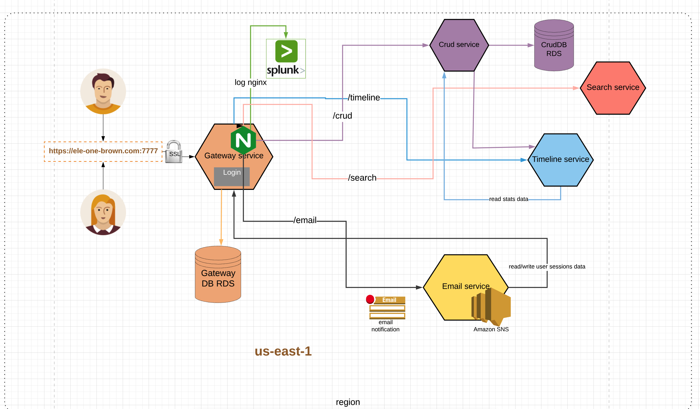
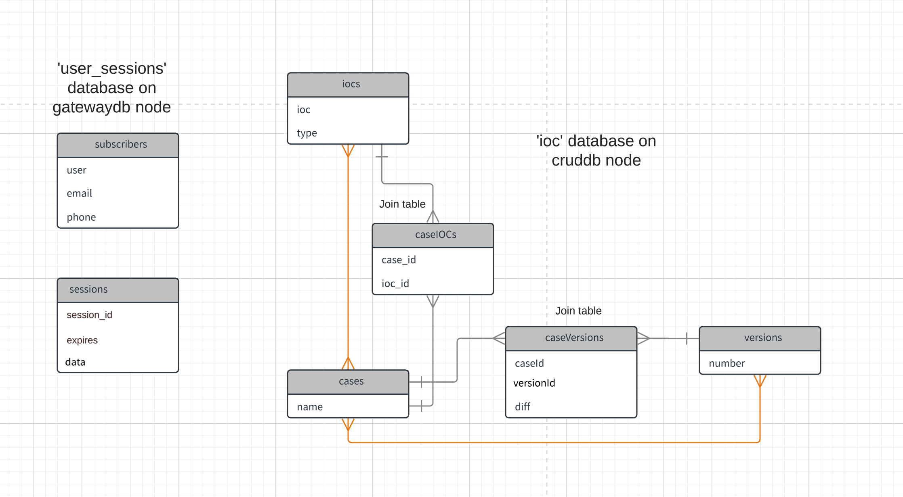
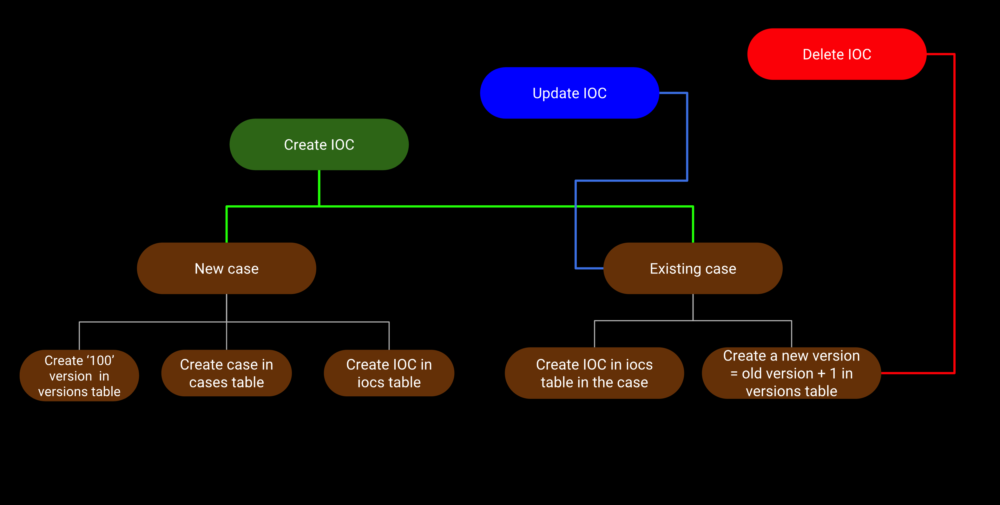
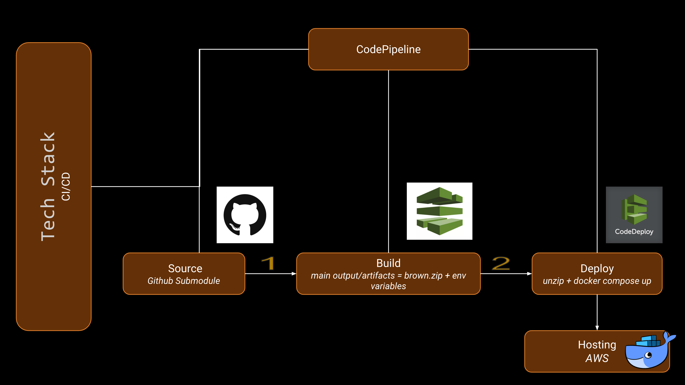
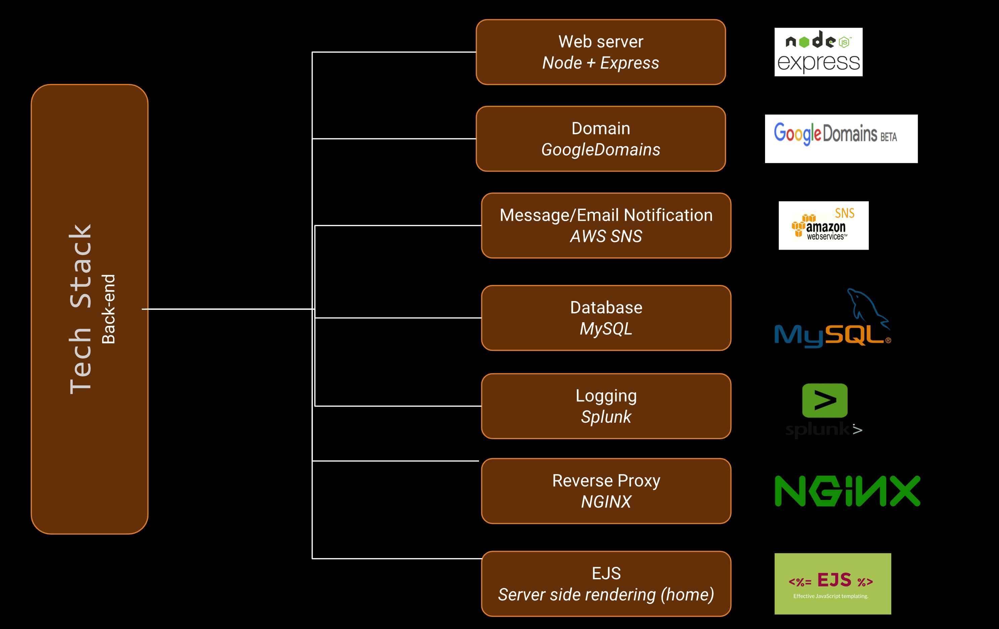
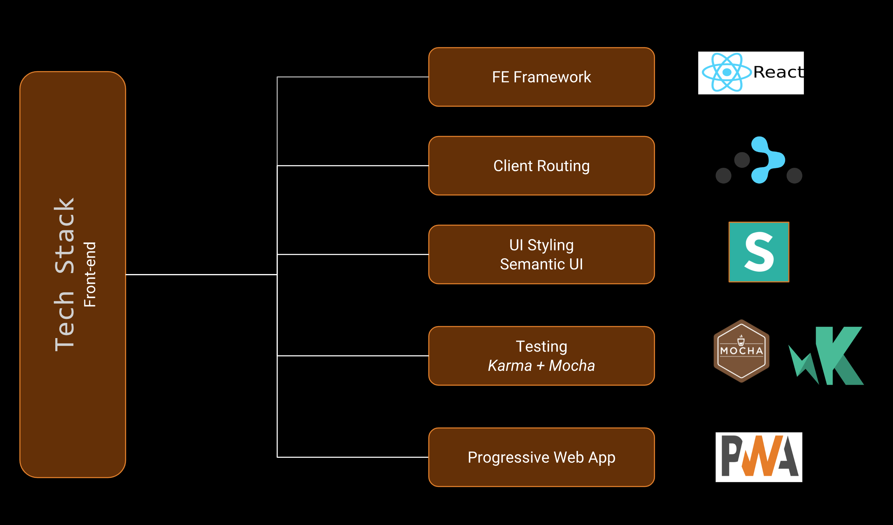

## What is Brown?
Brown is an IOC (Indicator Of Compromise) management, versioning, analysis and search automation application system.

## Highlights
<ul>
    <li> Uses Splunk for logging nginx access attempts </li>
    <li> Formulates a new way of versioning IOCs </li>
    <li> Able to search various versions within log files </li>
    <li> A 62% progressive web application </li>
    <li> Makes use nginx for reverse proxying </li>
    <li> Uses Splunk for nginx access logs </li>

</ul>

## Microservice Architecture
 It is a loosely coupled microservice architecture comprising of 4 services
<ul>
    <li> crud </li>
    <li> search </li>
    <li> email </li>
    <li> timeline </li>
</ul>

## Database Schema

<ul>
    <li> iocs <-many-to-many-> cases </li>
    <li> cases <-many-to-many-> versions </li>
</ul>

## Versioning logic

## Tech Stack

## GitHub
<a href="https://github.com/ele-one/brown"> https://github.com/ele-one/brown </a>

## Authors
<ul>
    <li> <a href="https://github.com/ram46"> ram46 </a>  </li>
    <li> <a href="https://github.com/key-er"> key-er </a> </li>
</ul>
